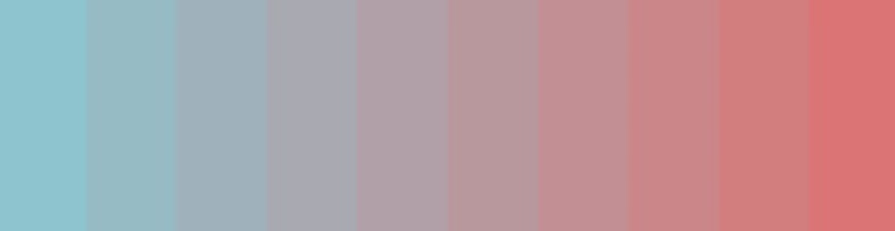

# Trabajo Practico Programacion 3 (27/11)

## Integrantes del grupo

- Tobias Pasinato
- Matias Prutscher

## Descripción

### Tienda Gamer

- Nombre de la Empresa: Timeless Pixels.
- Elementos de venta: Consolas y Juegos
- 10 consolas
- 10 juegos
- Paleta de colores:

| Light Color | Dark Color |
|-------------|------------|
| 8EC4D0 (celeste)    | 314449 (celeste)     |
| 97BBC6      | 364247     |
| 9FB2BC      | 3B4044     |
| A8A9B1      | 403E42     |
| B1A0A7      | 453C3F     |
| B9989D      | 493B3D     |
| C28F93      | 4E393A     |
| CB8688      | 533738     |
| D37D7E      | 583535     |
| DC7474 (rojo)    | 5D3333 (rojo)     |

Light Color

Dark Color

Estructura de archivos:

TP-Programacion-III-Pasinato-Prutscher.2024-c2 │ ├── ArchivosReadme │ ├── dark.png │ └── light.png │ ├── frontend │ ├── assets │ │ ├── candado.png │ │ ├── carrito-de-compras.png │ │ ├── favicon.png │ │ ├── imagen-login.webp │ │ ├── Logo-Timeless_Pixel.webp │ │ └── videojuegos.png │ ├── Home │ │ ├── home.html │ │ ├── scripts_home.js │ │ └── styles_home.css │ ├── LoginAdmin │ │ ├── log_admin.html │ │ └── scripts_login_admin.js │ ├── fonts.css │ ├── index.html │ ├── scripts.js │ └── styles.css │ └── backend └── main.js
